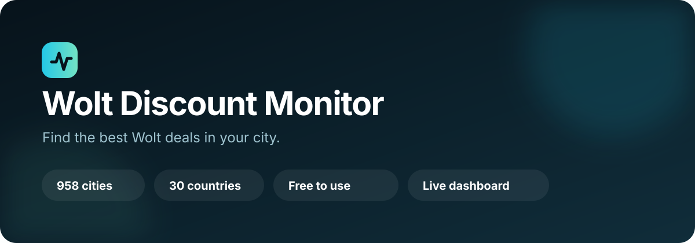
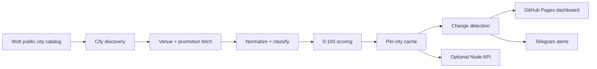

<div align="center">
  

  <br />

  **Find Wolt discounts worth ordering from — without checking venues one by one.**

  [**🍔 Open the free live dashboard →**](https://bl0ck154.github.io/wolt-discount-monitor/)

  [](https://github.com/Bl0ck154/wolt-discount-monitor/actions/workflows/test.yml)
  [](https://github.com/Bl0ck154/wolt-discount-monitor/actions/workflows/deploy-pages.yml)
  [](LICENSE)
  
  
  
</div>

> [!NOTE]
> Independent open-source project. Not affiliated with or endorsed by Wolt.

## A deal finder for people who actually use Wolt

Wolt can have a lot of promotions at the same time, but finding the useful ones often means opening venues one by one and scrolling past repeated delivery campaigns or discounts that only apply to selected products.

**Wolt Discount Monitor is a free public website built to make that easier.** It brings visible Wolt promotions into one searchable dashboard, ranks offers by estimated value, filters common noise, and lets you jump straight to a venue when you find something worth ordering.

**Nothing to install and no account required.** Open the site, search your city, and browse the deals.

### What you can do

- 🌍 Search a discovered catalog of **958 Wolt cities across 30 countries**.
- 🔥 See current venue promotions in one place.
- 📊 Sort deals by an estimated **0–100 value score**.
- 🔎 Search by venue, promotion, address, or category.
- 🧹 Hide repetitive citywide and ordinary delivery offers.
- 🍕 Distinguish broad basket discounts from selected-item promotions.
- 🕒 Check opening status and put open venues first.
- 📍 Open a venue on Wolt or view its location on the map.
- 🔗 Share the current city directly from the URL.

## Use the dashboard

### **[Open Wolt Discount Monitor →](https://bl0ck154.github.io/wolt-discount-monitor/)**

1. Search for your city in the city picker.
2. Filter or search the available venues and promotions.
3. Sort by **Best discount** to bring stronger offers to the top.
4. Open the venue on Wolt when you find a deal you want.

The city picker searches the full discovered catalog instead of presenting a hand-picked list of example cities. Bundled snapshots are used when available; the deployment can optionally use the live API for cities whose bundled data is missing or stale.

## How deals are ranked

Raw promotion text is not very useful for comparing hundreds of venues, so the project normalizes offers into a shared **0–100 value score**.

The classifier distinguishes between:

- broad basket discounts;
- selected-item discounts;
- delivery discounts;
- new-user delivery campaigns;
- multibuy and perk-style offers.

The score is currency-independent, which keeps ranking behavior consistent across countries. Repeated chain locations and campaigns are also grouped where appropriate so one network-wide campaign does not overwhelm the results.

The same scoring logic is used by the website and the monitoring/notification pipeline.

Research notes and endpoint observations are documented in [`FINDINGS.md`](FINDINGS.md).

## What runs behind the website

The public dashboard is backed by an automated monitoring pipeline:

- discovers Wolt's public city catalog;
- fetches public venue and promotion data;
- normalizes and classifies promotions;
- assigns the 0–100 value score;
- stores per-city snapshots and cache metadata;
- detects appeared and ended campaigns;
- can send Telegram alerts for qualifying offers in the production monitor;
- deploys the website through GitHub Pages;
- can optionally use a rate-limited Node.js API for uncached or stale city data.



The dashboard is **static-first**: cached snapshots under `docs/data/` can be served directly by GitHub Pages, so the public site is not designed around a mandatory private backend.

## Project structure

| Path | Purpose |
| --- | --- |
| `src/` | city discovery, Wolt requests, normalization, scoring, changes, API |
| `docs/` | public GitHub Pages dashboard |
| `docs/data/` | city catalog, snapshots, change history, notification state |
| `test/` | Node.js test suite |
| `.github/workflows/` | tests, monitoring, data compaction, Pages deployment |
| `scripts/` | operational dispatcher helpers |

## Public Wolt endpoints used

```text
GET https://restaurant-api.wolt.com/v1/cities
GET https://consumer-api.wolt.com/v1/pages/venue-list/promotions-near-you?lon=<lon>&lat=<lat>
GET https://consumer-api.wolt.com/v1/pages/restaurants?lat=<lat>&lon=<lon>
```

Consumer API requests use:

```text
Platform: Web
```

## Run locally

**Requirements:** Node.js 20 or newer. The project currently has no runtime npm dependencies; it uses Node's built-in `fetch` and test runner.

```bash
git clone https://github.com/Bl0ck154/wolt-discount-monitor.git
cd wolt-discount-monitor
npm test
npm run cities
npm run check
```

Check one discovered city:

```bash
WOLT_CITY=<country-code>/<city-slug> node src/check-discounts.mjs
```

Check several cities:

```bash
WOLT_CITIES=<country>/<city>,<country>/<city> node src/check-discounts.mjs
```

Check the full discovered catalog:

```bash
WOLT_ALL_CITIES=true node src/check-discounts.mjs
```

Open `docs/index.html` locally. The committed `docs/config.js` contains an empty API origin, so the repository does not ship a private backend address.

## Data and caching

Important generated files include:

```text
docs/data/city-catalog.json
docs/data/cities.json
docs/data/latest.json
docs/data/changes.json
docs/data/changes-log.json
docs/data/notified-offers.json
docs/data/cities/<country-city-slug>/latest.json
docs/data/cities/<country-city-slug>/changes.json
docs/data/cities/<country-city-slug>/changes-log.json
```

Each city has its own cache. If a snapshot is newer than `WOLT_CACHE_TTL_HOURS`, the updater reuses it instead of calling Wolt again. The default is one hour. The live API deduplicates concurrent refreshes for the same city and serves a stale snapshot immediately while revalidating it in the background.

Different cities refresh through a bounded worker pool rather than one global serial queue. The default live-API concurrency is four cities, with a bounded waiting queue. Wolt's two city endpoints are spaced by a short configurable delay instead of the older fixed five-second pause.

Requests use timeouts and retry transient network failures, HTTP `429`, temporary invalid responses, and server-side `5xx` errors. Permanent client errors such as `404` are not retried.

Direct VPS access is the primary transport. If `WOLT_PROXY_URL` is configured, direct `403`/`429` or network failures can automatically retry through that proxy. The proxy URL is a server secret and must never be committed.

## Optional live API

The static dashboard can optionally use the included Node.js API:

```bash
npm run server
```

Available endpoints include:

```text
GET /health
GET /api/cities
GET /api/cities/<country>/<city>/latest
```

The API binds to loopback by default. A public HTTPS origin can be injected into the Pages deployment through the repository variable `WOLT_API_BASE_URL`; that value is intentionally visible to browsers and is **not a secret**.

See [`OPERATIONS.md`](OPERATIONS.md) for deployment and runtime configuration.

## Telegram notifications

Production alerts read credentials only from GitHub Actions secrets:

```text
TELEGRAM_BOT_TOKEN
TELEGRAM_CHAT_ID
```

If a qualifying alert is pending but credentials are unavailable, the updater fails before committing the new notification state. This avoids silently losing a deal notification.

## Automation

| Workflow | Purpose |
| --- | --- |
| [`test.yml`](.github/workflows/test.yml) | runs the Node.js test suite on relevant pushes and pull requests |
| [`check-discounts.yml`](.github/workflows/check-discounts.yml) | refreshes data, sends alerts, and commits generated changes |
| [`compact-data.yml`](.github/workflows/compact-data.yml) | keeps generated history manageable |
| [`deploy-pages.yml`](.github/workflows/deploy-pages.yml) | deploys the public dashboard |

The data updater runs only through explicit dispatch events on self-hosted project runners; ordinary pull requests run tests on GitHub-hosted infrastructure instead.

## Privacy and security

Secret values, Telegram chat IDs, private server addresses, private filesystem paths, and credentials must stay outside Git. The committed `docs/config.js` contains no backend address, and production Telegram credentials are referenced only through environment variables / GitHub Actions secrets.

For vulnerability reporting and the public/private deployment boundary, see [`SECURITY.md`](SECURITY.md).

## Contributing

Bug reports, edge cases from other cities, scoring improvements, and dashboard ideas are welcome. See [`CONTRIBUTING.md`](CONTRIBUTING.md) before opening a pull request.

If a Wolt response shape is not handled correctly, include only a **sanitized** example payload or the minimum structure needed to reproduce it.

## License

Released under the [`MIT License`](LICENSE).

---

<div align="center">
  <strong>Built to make Wolt promotions easier to discover and compare.</strong>
  <br /><br />
  <a href="https://bl0ck154.github.io/wolt-discount-monitor/"><strong>Open the dashboard</strong></a>
  ·
  <a href="https://github.com/Bl0ck154/wolt-discount-monitor/issues"><strong>Report an issue</strong></a>
</div>